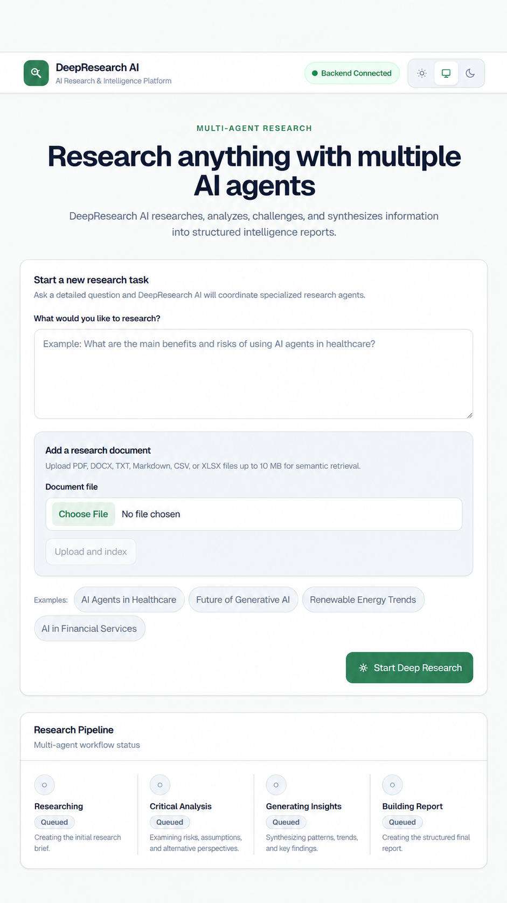
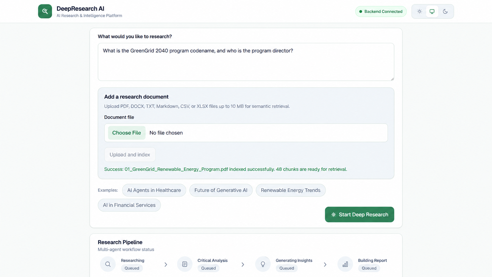
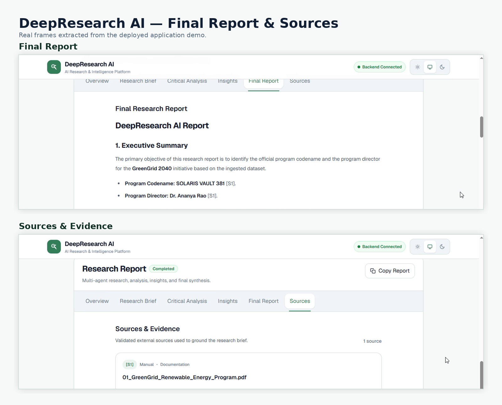
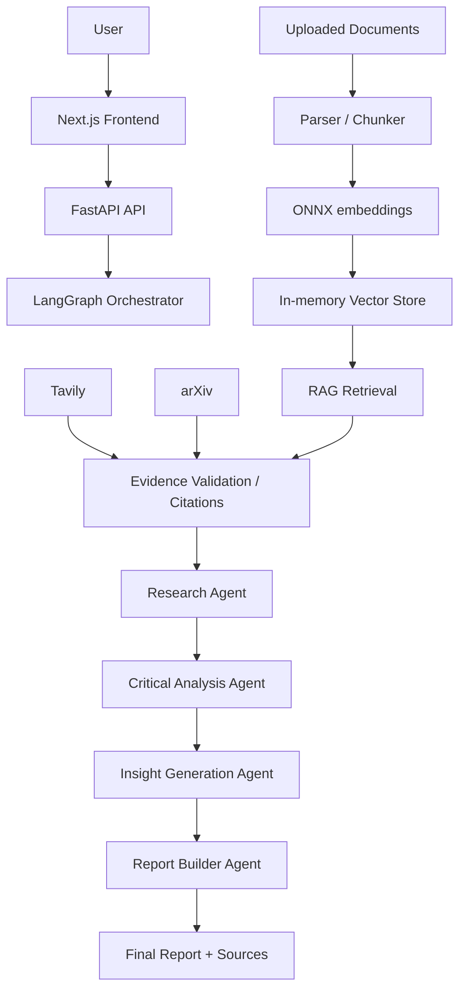

# DeepResearch AI

Multi-Agent AI Research & Intelligence Platform

DeepResearch AI is a full-stack research workflow that turns a user question into a structured evidence-backed report. The app combines a Next.js frontend, a FastAPI backend, local document ingestion, external research sources, and a multi-agent orchestration pipeline for research, critique, insight generation, and final report assembly.

- [Live Demo](https://deepresearch-ai-theta.vercel.app)
- [API Docs](https://deepresearch-ai-backend.onrender.com/docs)
- [GitHub Repository](https://github.com/shantanu-c25/deepresearch-ai)

## Overview

Research work often requires gathering sources, comparing claims, identifying weak points, and turning scattered findings into a usable report. This project follows a controlled workflow rather than a single monolithic prompt: specialized agents work in sequence, using retrieved evidence and uploaded documents as the factual basis for the final output.

The system accepts a research question, optionally ingests local documents, retrieves relevant context from RAG and external sources, validates evidence and citations, and then runs a multi-agent process that produces a brief, a critical analysis, insights, and a final report. The frontend presents the result with source references and backend health status.

## What It Does

The application is designed around a practical research loop:

1. A user enters a research question in the frontend.
2. Optional document uploads are parsed, chunked, embedded, and indexed for local retrieval.
3. Retrieval uses local semantic search and external sources such as Tavily and arXiv.
4. Evidence is validated and citation IDs are assigned before the analysis stages begin.
5. The research pipeline runs through a LangGraph orchestrator.
6. The Research Agent builds the initial brief, the Critical Analysis Agent checks the claim quality, the Insight Generation Agent synthesizes patterns, and the Report Builder Agent produces the final report.
7. The final response is displayed with sources and citations in the UI.

## Product Walkthrough

### 1. Research Workspace

Start with a research question, optionally upload supporting documents, and prepare them for semantic retrieval.



### 2. Multi-Agent Research Pipeline

Uploaded documents are indexed for retrieval, while the research workflow moves through Research, Critical Analysis, Insight Generation, and Report Building.



### 3. Evidence-Grounded Report

The completed workflow produces a structured research report with citation references and source evidence.



## Key Features

- Next.js 16 frontend with React 19 and TypeScript
- FastAPI backend with Pydantic models
- Multi-agent LangGraph workflow for research, critical analysis, insights, and final reporting
- Local RAG pipeline with semantic retrieval and chunking
- Uploaded document ingestion for PDF, DOCX, TXT, Markdown, CSV, and XLSX
- Evidence validation and citation assignment
- External retrieval via Tavily and arXiv
- ONNX-based embedding runtime to reduce production memory pressure
- Light/dark theme and responsive UI
- Backend health checks and deployment health endpoint

## Architecture



Agent stages currently run sequentially so each stage can use the output and evidence produced by the previous stage.

## Agent Responsibilities

| Agent | Responsibility |
| --- | --- |
| Research Agent | Builds the initial evidence-based brief, key concepts, and open questions. |
| Critical Analysis Agent | Reviews the brief for weak claims, missing perspectives, contradictions, and verification gaps. |
| Insight Generation Agent | Identifies patterns, trends, implications, and higher-level conclusions. |
| Report Builder Agent | Combines the prior stages into a final structured report with source-aware synthesis. |

## Tech Stack

| Area | Stack |
| --- | --- |
| Frontend | Next.js 16, React 19, TypeScript |
| Backend / API | Python, FastAPI, Pydantic |
| AI / LLM | Gemini, Google GenAI Python SDK |
| Agent orchestration | LangGraph |
| RAG | local semantic retrieval, chunking, ranking, evidence formatting |
| Embeddings | sentence-transformers/all-MiniLM-L6-v2, ONNX Runtime |
| Retrieval | Tavily, arXiv |
| Testing | Pytest, Vitest |
| Deployment | Vercel, Render, Uvicorn |

## Supported Documents

The application accepts the following uploaded document types:

- PDF
- DOCX
- TXT
- Markdown
- CSV
- XLSX

## Project Structure

```text
deepresearch-ai/
├── backend/
│   ├── agents/
│   ├── models/
│   ├── rag/
│   ├── retrieval/
│   ├── services/
│   ├── tests/
│   ├── validation/
│   ├── config.py
│   ├── main.py
│   ├── orchestrator.py
│   ├── requirements.txt
│   └── scripts/
├── frontend/
│   ├── src/
│   ├── package.json
│   ├── next.config.ts
│   └── tsconfig.json
├── docs/
│   └── screenshots/
├── examples/
├── .env.example
├── .gitignore
├── README.md
└── render.yaml
```

## Local Setup

### Prerequisites

- Python 3.12 recommended
- Node.js and npm
- Git

### Clone

```bash
git clone https://github.com/shantanu-c25/deepresearch-ai.git
cd deepresearch-ai
```

### Backend

Create a virtual environment from the project root:

For Windows PowerShell:

```powershell
py -3.12 -m venv .venv
.\.venv\Scripts\Activate.ps1
```

Install dependencies:

```bash
pip install -r backend/requirements.txt
```

Create a local backend environment file based on the repository template:

```bash
copy .env.example backend/.env
```

Then configure the values you need locally. The Gemini integration accepts either `GOOGLE_API_KEY` or `GEMINI_API_KEY`. `TAVILY_API_KEY` is required only when using Tavily-backed web retrieval. `ALLOWED_ORIGINS` controls browser access for the frontend. Real credentials must not be committed.

```env
GOOGLE_API_KEY=
GEMINI_API_KEY=
GEMINI_PRIMARY_MODEL=gemini-3.6-flash
GEMINI_FALLBACK_MODEL=gemini-3.5-flash-lite
GEMINI_REQUEST_TIMEOUT_MS=120000
GEMINI_MAX_ATTEMPTS=2
TAVILY_API_KEY=
ALLOWED_ORIGINS=http://localhost:3000,http://127.0.0.1:3000
```

### ONNX embedding model

The production/local ONNX export is generated with:

```bash
python backend/scripts/export_onnx_model.py
```

This writes the generated runtime model under:

```text
backend/rag/onnx_model/
```

The directory is intentionally Git-ignored, and the export depends on the model package/network download path used by the script.

### Start backend

From the project root:

```bash
uvicorn backend.main:app --reload --host 127.0.0.1 --port 8000
```

The API is available at:

```text
http://127.0.0.1:8000
```

### Frontend

In a separate terminal:

```bash
cd frontend
npm install
```

Create the frontend environment file manually:

```powershell
New-Item .env.local -ItemType File -Force
```

Then add:

```env
NEXT_PUBLIC_API_BASE_URL=http://127.0.0.1:8000
```

Start the app:

```bash
npm run dev
```

The frontend runs at:

```text
http://localhost:3000
```

## API

The backend exposes the following endpoints:

### GET /health

Checks whether the API is running.

```bash
curl http://127.0.0.1:8000/health
```

### POST /ai/generate

Generate a plain-text AI response from a prompt.

```bash
curl -X POST http://127.0.0.1:8000/ai/generate \
  -H "Content-Type: application/json" \
  -d '{"prompt": "Explain retrieval-augmented generation."}'
```

### POST /rag/documents

Upload a document for local RAG indexing.

```bash
curl -X POST http://127.0.0.1:8000/rag/documents \
  -F "file=@sample.pdf"
```

### POST /rag/retrieve

Retrieve relevant chunks from the in-memory RAG store.

```bash
curl -X POST http://127.0.0.1:8000/rag/retrieve \
  -H "Content-Type: application/json" \
  -d '{"question": "What are the main findings?", "top_k": 5}'
```

### POST /research

Run the full research workflow for a question.

```bash
curl -X POST http://127.0.0.1:8000/research \
  -H "Content-Type: application/json" \
  -d '{"question": "What are the main benefits and risks of AI agents in healthcare?"}'
```

## Testing

Current release validation commands:

```bash
python -m pytest backend/tests -q
```

```bash
cd frontend
npm run test:run
npm run build
```

The repo includes both backend and frontend automated tests, and the deployment configuration is intended to be validated from the project root and the frontend directory separately.

## Deployment

### Backend — Render

The repository includes a Render configuration in [render.yaml](render.yaml). The backend service is configured as a free web service using Uvicorn and a health check endpoint. The Render build command performs the ONNX export step before the app starts:

```bash
pip install -r backend/requirements.txt && python backend/scripts/export_onnx_model.py
```

Render variables are conceptually split into credentials / integration settings and configuration defaults:

Credentials / integration:

- `GEMINI_API_KEY` or `GOOGLE_API_KEY`
- `TAVILY_API_KEY` when Tavily retrieval is used
- `ALLOWED_ORIGINS` for browser frontend access

Configuration / default tuning:

- `GEMINI_PRIMARY_MODEL`
- `GEMINI_FALLBACK_MODEL`
- `GEMINI_REQUEST_TIMEOUT_MS`
- `GEMINI_MAX_ATTEMPTS`

### Frontend — Vercel

The frontend is deployed using the Vercel project root set to `frontend`. The required public environment variable is:

```env
NEXT_PUBLIC_API_BASE_URL=https://deepresearch-ai-backend.onrender.com
```

Do not place Gemini or Tavily secrets in `NEXT_PUBLIC_*` variables.

## Engineering Note: Render Memory Optimization

This project originally used the Python sentence-transformers runtime locally, but Render Free enforces a 512 MB memory limit. During local profiling, document indexing with the PyTorch runtime reached approximately 487.7 MiB peak RSS even at batch size 1. To preserve the same `all-MiniLM-L6-v2` semantics while lowering memory usage, the embedding runtime was moved to ONNX Runtime for production use. The measured indexing footprint dropped to roughly 225.5 MiB in local checks, and the RAG upload and retrieval path was verified afterward in the deployed environment.

## Limitations

- Uploaded documents and vectors currently live in process memory.
- A Render restart or redeploy clears uploaded RAG state.
- Free-tier hosting can cold-start and may be slower than local development.
- External research depends on provider availability, API quotas, and network reliability.
- Generated analysis can still include hypotheses; important claims should be checked against cited evidence.
- This is a hackathon and learning-focused project, not a production compliance system.

## Future Improvements

- Persistent vector storage
- User and session isolation
- Streaming backend progress updates
- Stronger grounding and hallucination controls
- Improved source ranking and evidence scoring
- Authentication and authorization
- Better observability and deployment monitoring
- Document management workflows
- Scaling beyond the current free-tier deployment model

## Author

Shantanu Chattopadhyay

Built as part of an AI Engineering hackathon.
